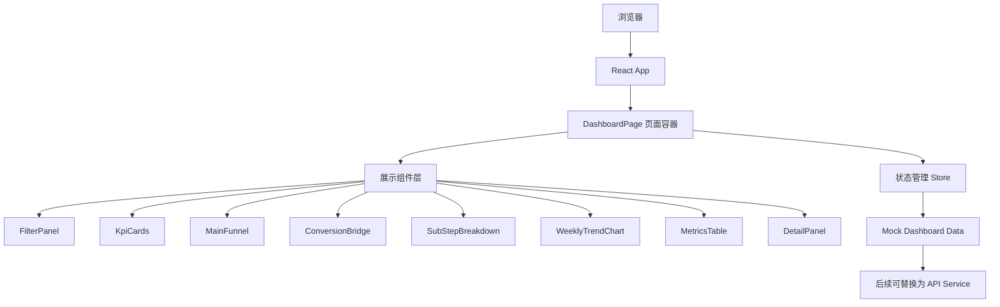

# Seller Onboarding 数据漏斗看板技术架构文档

## 1. 架构设计
本项目是纯前端展示型 dashboard 原型，不包含后端、数据库和真实接口。应用通过本地 mock data 驱动组件渲染，后续可将 `data` 层替换为 API service。



## 2. 技术说明
- **前端**：React 18 + TypeScript + Vite。
- **样式**：Tailwind CSS 3 + 局部 CSS 变量，保持企业看板风格和可维护设计 token。
- **状态管理**：Zustand，管理筛选器、选中阶段、筛选器折叠、loading、趋势高亮指标。
- **图标**：`lucide-react`，用于筛选、刷新、箭头、审核状态和详情面板。
- **图表**：优先使用轻量自绘 SVG 折线图，避免引入重型图表库；如模板已包含图表依赖，可复用。
- **后端**：无。
- **数据库**：无。
- **数据来源**：本地 mock data，字段与 PRD 保持一致，所有真实指标展示为 `xx` 或 `xx%`。

## 3. 路由定义
| 路由 | 用途 |
|------|------|
| `/` | 展示 Seller Onboarding Funnel Dashboard |
| `/onboarding` | 与 `/` 指向同一个看板页面，便于后续接入导航 |

## 4. 模块划分
| 目录 / 文件 | 职责 |
|-------------|------|
| `src/pages/DashboardPage.tsx` | 页面编排，串联所有看板模块 |
| `src/components/TopTabs.tsx` | 顶部 tabs |
| `src/components/DashboardTitle.tsx` | 标题卡片 |
| `src/components/FilterPanel.tsx` | 筛选器、Apply/Reset/Collapse |
| `src/components/KpiCards.tsx` | 6 个核心 KPI |
| `src/components/MainFunnel.tsx` | 四阶段漏斗、箭头和阶段点击 |
| `src/components/ConversionBridge.tsx` | 转化率卡片、hover 公式、click 高亮 |
| `src/components/SubStepBreakdown.tsx` | Register/Submit/Moderate/Onboard 子环节 |
| `src/components/WeeklyTrendChart.tsx` | 周维度趋势图和 legend |
| `src/components/MetricsTable.tsx` | 指标明细表、sticky 首列、行点击 |
| `src/components/DetailPanel.tsx` | 阶段详情面板 |
| `src/data/mockDashboardData.ts` | mock data 与字段定义 |
| `src/store/dashboardStore.ts` | Zustand 状态与动作 |
| `src/types/dashboard.ts` | 看板类型定义 |
| `src/utils/dashboard.ts` | Business Details 显隐、指标格式、关联高亮工具函数 |

## 5. 数据模型

### 5.1 DashboardData
```ts
export interface DashboardData {
  filters: DashboardFilters;
  kpis: DashboardKpis;
  funnel: FunnelStage[];
  conversions: DashboardConversions;
  submitSubSteps: SubmitSubStep[];
  moderateSubSteps: ModerateSubStep[];
  weeklyMetrics: WeeklyMetric[];
}
```

### 5.2 核心状态
```ts
export interface DashboardState {
  selectedStage: "register" | "submit" | "moderate" | "onboard";
  filtersCollapsed: boolean;
  filters: DashboardFilters;
  highlightMetric: string | null;
  loading: boolean;
  activeTrendMetric: string;
}
```

### 5.3 Business Details 显隐规则
```ts
export const shouldShowBusinessDetails = (businessType: string) =>
  businessType !== "personal";
```

## 6. 交互设计
- **Apply**：设置 `loading = true`，显示 mock loading 状态，约 500ms 后恢复，数据仍保持 `xx` 占位。
- **Reset**：恢复 `mockDashboardData.filters`，清空高亮状态。
- **Collapse Filters**：折叠为一行摘要 chip，再次点击展开。
- **点击漏斗阶段**：更新 `selectedStage`，高亮主漏斗卡片，滚动到对应子模块，展示详情面板。
- **点击转化卡片**：更新 `highlightMetric`，高亮相关漏斗阶段和表格行。
- **点击 Metrics Table 行**：更新 `activeTrendMetric`，趋势图切换或强调对应指标。
- **hover 指标**：使用原生 title 或轻量 tooltip 展示字段名、中文释义、numerator、denominator 和 mock data 标记。

## 7. 质量门禁
- 初始化后运行依赖安装。
- 每个 MVP 切片完成后运行 TypeScript / lint 检查，优先使用 `npm run check` 或项目内已有检查命令。
- 开发完成后启动本地 dev server，并通过浏览器验证首屏、筛选器交互、Business Details 显隐、漏斗点击、表格点击和趋势区域展示。
- 不在前端写入任何密钥、真实 token 或私密配置。

## 8. 实施切片
1. **工程初始化切片**：用 React TS 模板初始化项目、安装依赖、确认 dev server 可启动。
2. **数据与骨架切片**：建立类型、mock data、store、页面布局和基础样式 token。
3. **首屏核心切片**：实现 Tabs、标题、筛选器、KPI 和主漏斗，确保首屏可展示。
4. **业务拆解切片**：实现 Conversion Bridge、子环节拆解和 Detail Panel。
5. **分析区切片**：实现 Weekly Trend、Metrics Table 和行点击联动。
6. **验证收尾切片**：运行检查、浏览器验证、修复样式和交互问题。

## 9. 当前约束
- 当前目录未检测到现有前端工程。
- 当前环境暂未检测到 `node`、`npm` 或 `pnpm` 命令，进入实现阶段前需要安装或切换到具备 Node.js 的环境。
- 当前环境未检测到 `lark-cli`，因此分析文档暂未能拉取；实现先严格遵循本地 PRD，后续可根据飞书分析文档修订。
