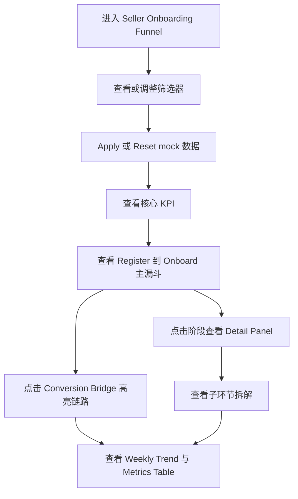

# Seller Onboarding 数据漏斗看板产品需求文档

## 1. 产品概述
Seller Onboarding 数据漏斗看板用于向业务负责人、产品、研发和数据分析同学展示卖家从注册到入驻的全链路转化表现。
- 主要解决旧看板信息分散、关键漏斗口径不够直观、子环节和字段映射不易对齐的问题。
- 当前版本定位为高保真展示原型，不接入真实接口，所有真实数据位置使用 `xx`、`xx%` 或 mock 占位。

## 2. 核心功能

### 2.1 用户角色
| 角色 | 使用场景 | 关注重点 |
|------|----------|----------|
| 业务 Owner / PM | 向老板汇报 onboarding 整体进展 | 主漏斗、核心 KPI、关键转化率、主要掉点 |
| 研发 | 评审埋点、接口和字段需求 | 字段 key、子流程、口径说明、交互状态 |
| 数据分析 | 对齐指标口径和旧看板迁移 | 筛选器、周维度趋势、metrics table |

### 2.2 功能模块
1. **顶部导航 Tabs**：展示 `Onboarding`、`Custom Onboarding Report`、`WIP/Fund`、`Daily Push`，当前页高亮 `Onboarding`。
2. **标题与筛选器**：展示页面标题、旧看板风格多行筛选器、Apply/Reset/Collapse 操作。
3. **核心 KPI 区域**：展示注册、提资、一次性通过、入驻量、注册到入驻、提资到入驻等 6 个指标。
4. **主漏斗模块**：横向展示 `Register → Submit → Moderate → Onboard` 四阶段及相邻转化率。
5. **子环节拆解模块**：按四个主阶段展示注册入口、提资页面进度、审核检查项、入驻转化。
6. **Conversion Bridge**：集中展示关键转化率，支持 hover 查看公式、click 高亮关联阶段和指标。
7. **Weekly Trend 与 Metrics Table**：展示周维度趋势图和旧 Aeolus 风格明细表。
8. **Detail Drawer / Inline Panel**：点击主漏斗阶段后展示阶段指标、字段名、口径说明和相关转化。

### 2.3 页面详情
| 页面名称 | 模块名称 | 功能描述 |
|----------|----------|----------|
| `Seller Onboarding Funnel` | 顶部 Tabs | 当前页高亮，其他 Tab 可点击但不跳转，hover 展示浅蓝反馈 |
| `Seller Onboarding Funnel` | 筛选器区域 | 保留旧看板 14 个筛选字段，支持 mock dropdown、Apply loading、Reset、Collapse |
| `Seller Onboarding Funnel` | KPI 卡片 | 6 个核心指标卡片，展示 `T14`、mock 数值和 hover 边框反馈 |
| `Seller Onboarding Funnel` | 主漏斗 | 4 阶段横向漏斗，箭头展示 `Register → Submit`、`Submit → Moderate` 转化 |
| `Seller Onboarding Funnel` | 子环节拆解 | Submit 支持 Business Details 在 `personal` 场景下隐藏，Moderate 不展示 UBO |
| `Seller Onboarding Funnel` | Conversion Bridge | 展示 4 个关键转化率，不展示 `Moderate → Onboard` |
| `Seller Onboarding Funnel` | Weekly Trend | 展示 4 条转化率趋势线，支持 legend 切换 |
| `Seller Onboarding Funnel` | Metrics Table | 周维度列、首列 sticky、hover 行高亮、点击行联动趋势指标 |

## 3. 核心流程
用户进入看板后先通过顶部筛选器确认数据范围，再查看 KPI 和主漏斗定位整体表现；点击漏斗阶段或转化卡片后，页面高亮相关阶段、滚动到对应子模块，并在详情面板中展示字段和口径；最后通过趋势图和明细表查看周维度变化。

## 4. 用户界面设计

### 4.1 设计风格
- **整体风格**：参考旧 Aeolus 数据看板，白色背景、浅灰页面底、蓝色模块边框、深蓝表头、紧凑企业级 dashboard 质感。
- **主色**：页面背景 `#f7f8fa`，卡片背景 `#ffffff`，主蓝 `#5f7fae`，深蓝表头 `#6f86ad`，浅蓝边框 `#9bb3d6`。
- **辅助色**：文本主色 `#1f2329`，文本次色 `#646a73`，分割线 `#e5e6eb`，成功绿 `#2da44e`，警示黄 `#d4a72c`。
- **字体**：优先使用系统无衬线字体，标题 24-28px / 600，模块标题 16px / 600，KPI 数字 28-32px / 700，表格和筛选器 12px。
- **布局**：桌面优先，页面 padding 16px，模块间距 12-16px，卡片化与表格化混合布局。
- **动效**：控制在企业看板可接受范围内，使用轻量 hover、loading skeleton、阶段高亮、drawer slide-in。

### 4.2 页面设计总览
| 页面名称 | 模块名称 | UI 元素 |
|----------|----------|---------|
| `Seller Onboarding Funnel` | 标题区 | 居中浅蓝描边圆角框，标题宽度约页面 60%-70%，高度约 48px |
| `Seller Onboarding Funnel` | 筛选器 | 3-4 列栅格、32px select、exclude chip、右上角操作按钮 |
| `Seller Onboarding Funnel` | KPI 区 | 6 张白底卡片、顶部蓝色细线、大数字、`T14` 标记 |
| `Seller Onboarding Funnel` | 主漏斗 | 4 张阶段卡片、箭头连接线、转化率标签、阶段 tag |
| `Seller Onboarding Funnel` | 子流程 | Register 文案卡、Submit stepper、Moderate 审核项小卡、Onboard 汇总卡 |
| `Seller Onboarding Funnel` | 图表和表格 | 白底折线图、浅灰网格线、深蓝表头、首列 sticky |

### 4.3 响应式
- 桌面优先，重点适配 1440px 以上宽屏。
- 宽度不低于 1280px 时完整展示主要模块。
- 低于 1280px 时主漏斗、趋势图和表格允许横向滚动。
- 筛选器支持折叠，表格必须支持横向滚动，首列 sticky。

## 5. 数据与字段

### 5.1 核心指标
| 指标 | 字段 | 展示 |
|------|------|------|
| Registered Seller | `registered_seller_t14` | `xx` |
| Submit Sellers T14 | `submit_sellers_t14` | `xx` |
| One Time Pass Seller T14 | `one_time_pass_seller_t14` | `xx` |
| Onboarded Seller Volume | `onboarded_seller_volume` | `xx` |
| Registration → Onboarding | `registration_to_onboarding_rate_t14` | `xx%` |
| Submit → Onboarding | `submit_to_onboarding_rate_t14` | `xx%` |

### 5.2 必须展示的转化率
| 转化链路 | 字段 | 展示 |
|----------|------|------|
| Register → Submit | `submission_rate_t14` | `xx%` |
| Submit → Moderate | `one_time_pass_rate_t14` | `xx%` |
| Register → Onboard | `registration_to_onboarding_rate_t14` | `xx%` |
| Submit → Onboard | `submit_to_onboarding_rate_t14` | `xx%` |

### 5.3 明确不展示
- 不展示 UBO 相关指标。
- 不展示 `Moderate → Onboard` 或 `moderate_to_onboarding_rate_t14`。
- 不展示审核到入驻转化率。

## 6. 验收标准
- 首屏能看到筛选器、KPI 卡片和主漏斗。
- 主漏斗必须包含 Register、Submit、Moderate、Onboard 四个阶段。
- 每个主阶段必须展示子数据或口径说明。
- 必须展示注册到提资、提资到审核、注册到入驻、提资到入驻四个转化率。
- Business Details 在 `business_type = personal` 时隐藏，Submit 阶段摘要变为 `3 sub steps`。
- `Good Seller or not` 和 `is_good_seller` 统一使用字段名 `is_good_seller`。
- 必须有 Weekly Trend 区域和旧看板风格 Metrics Table。
- 所有真实数据位置先用 `xx`、`xx%` 或 mock data 占位。
- 页面不能硬编码为图片，必须使用 HTML/CSS/前端组件实现。
- 代码结构要便于后续接入真实接口。

## 7. 非目标
- 不接入真实接口。
- 不做真实数据过滤。
- 不做权限控制。
- 不做数据导出。
- 不做移动端深度适配。
- 不做多语言切换。

## 8. 当前风险与待核对
- 分析文档位于飞书 Wiki：`https://bytedance.larkoffice.com/wiki/CevtwfXdIiuYsektdMscGdmin2g`。
- 当前环境未安装 `lark-cli`，暂时无法读取分析文档内容；本开发文档先基于本地 `seller_onboarding_funnel_dashboard_prd.md` 生成。
- 待能访问飞书文档后，需要补充核对旧看板分析、当前 onboarding 流程细节和新看板设计是否存在与本地 PRD 不一致之处。
